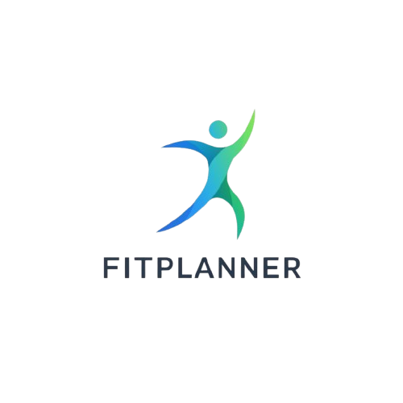

# FitPlanner - Frontend

<div align="center">

<br>
Seu assistente pessoal de fitness e nutrição, potencializado por Flutter
</div>

---

## 📋 Sobre o Projeto
FitPlanner é um aplicativo de saúde e fitness que combina **Personal Trainer** e **Nutrição** em uma plataforma inteligente. O app cria **planos de treino e dieta personalizados** baseados nas informações do usuário, como peso, altura, sexo, idade e composição corporal.

O projeto é o **frontend do app**, desenvolvido com **Flutter 3.x** e **Dart**, com integração com Firebase para autenticação e armazenamento de dados.

---

## 🎯 Problema que Resolve

- ❌ Treinos genéricos que não consideram biotipo
- ❌ Dietas que não levam em conta preferências alimentares
- ❌ Falta de acompanhamento personalizado
- ❌ Dificuldade de acompanhar progresso físico e composição corporal

### ✅ Solução

- ✨ Treinos personalizados por objetivo, sexo e BF
- ✨ Planos nutricionais adaptados às preferências do usuário
- ✨ Planner de treinos semanal
- ✨ Telas educativas sobre macronutrientes e suplementação

---

## 🛠 Tecnologias

**Frontend**
- Flutter 3.x
- Dart

**Backend & Serviços**
- Firebase Authentication
- Cloud Firestore
- API Python (FastAPI) para estimativa de Body Fat (opcional)

**Principais pacotes**
```yaml
firebase_core: ^2.24.2
firebase_auth: ^4.16.0
cloud_firestore: ^4.14.0
image_picker: ^1.0.7
table_calendar: ^3.0.9
http: ^1.2.0
🚀 Instalação
Pré-requisitos

Flutter SDK (>=3.0.0)

Dart SDK (>=3.0.0)

Android Studio ou VS Code

Conta Firebase configurada

Passos

bash
Copiar código
# Clone o repositório
git clone https://github.com/joaovilela-dev/fitplanner.git
cd fitplanner

# Instale as dependências
flutter pub get

# Execute o app
flutter run
📱 Funcionalidades do Frontend
1️⃣ Cadastro Nutricional Inteligente
Coleta de dados: peso, altura, idade, sexo

Definição de objetivos (ganho de massa, perda de peso, recomposição)

Nível de atividade física

Upload de foto para estimativa de BF (via backend opcional)

Ajuste manual de BF com slider

2️⃣ Chat com Personal Trainer
Conversa interativa com personal virtual

Seleção de dias de treino

Treinos adaptados por sexo e BF

3️⃣ Chat com Nutricionista
Questionário de dieta

Ajustes automáticos por BF

Visualização de refeições e calorias

4️⃣ Planner de Treinos
Calendário interativo (Table Calendar)

Adição, edição e remoção de treinos

Animações suaves e design glassmorphism

5️⃣ Telas Educativas
Macronutrientes (proteínas, carboidratos, gorduras)

Suplementos e vitaminas (previsto)

Hidratação (previsto)

🗂 Estrutura de Pastas e Arquivos
bash
Copiar código
FIT_PLANNER/
├── android/
├── ios/
├── linux/
├── macos/
├── web/
├── windows/
├── assets/
│   ├── fonts/
│   └── imagens/
├── lib/
│   ├── main.dart
│   ├── firebase_options.dart
│   ├── screens/
│   │   ├── agua_screen.dart
│   │   ├── ajuda_screen.dart
│   │   ├── cadastro_nutricional_screen.dart
│   │   ├── cadastro_screen.dart
│   │   ├── carboidratos_screen.dart
│   │   ├── chat_screen.dart
│   │   ├── creatina_screen.dart
│   │   ├── dieta_screen.dart
│   │   ├── edit_profile_screen.dart
│   │   ├── gorduras_screen.dart
│   │   ├── login_screen.dart
│   │   ├── macronutrients_screen.dart
│   │   ├── main_menu_screen.dart
│   │   ├── perfil_screen.dart
│   │   ├── planner_fitness_screen.dart
│   │   ├── proteinas_screen.dart
│   │   ├── suplementos_screen.dart
│   │   ├── vitaminas_minerais_screen.dart
│   │   └── whey_screen.dart
│   ├── widgets/          # Componentes reutilizáveis
│   └── services/         # Serviços e integração
├── test/
├── pubspec.yaml
└── README.md
🔐 Segurança e Boas Práticas
Nunca commite credenciais: google-services.json, .env

Use variáveis de ambiente para API Keys

Firebase: regras de segurança configuradas

🤝 Contribuindo
Faça um fork do projeto

Crie uma branch: git checkout -b feature/NovaFuncionalidade

Faça commit das alterações: git commit -m 'Adiciona nova funcionalidade'

Push para a branch: git push origin feature/NovaFuncionalidade

Abra um Pull Request

Guidelines

Código limpo e comentado

Testes unitários quando aplicável

Documentação atualizada

Seguir o design system do projeto

📝 Roadmap
✅ Implementado:

Cadastro nutricional

Chat Personal Trainer

Chat Nutricionista

Planner de Treinos

Telas Educativas

🚧 Em Desenvolvimento:

Telas de Hidratação e Suplementação

Gráficos de progresso

Histórico de peso/medidas

📅 Planejado:

Modo offline

Sincronização com wearables

Comunidade de usuários

Gamificação e desafios

Marketplace de treinos

📄 Licença
Este projeto está licenciado sob a MIT License.

👨‍💻 Autor
João Victor Vilela
GitHub: @joaovilela-dev
Email: joao2801vilela@gmail.com

🙏 Agradecimentos
Google AI - Gemini API

Firebase - Backend as a Service

Flutter - Framework de UI

Comunidade open source 💙

<div align="center"> ⭐ Se este projeto te ajudou, considere dar uma estrela! </div> ```